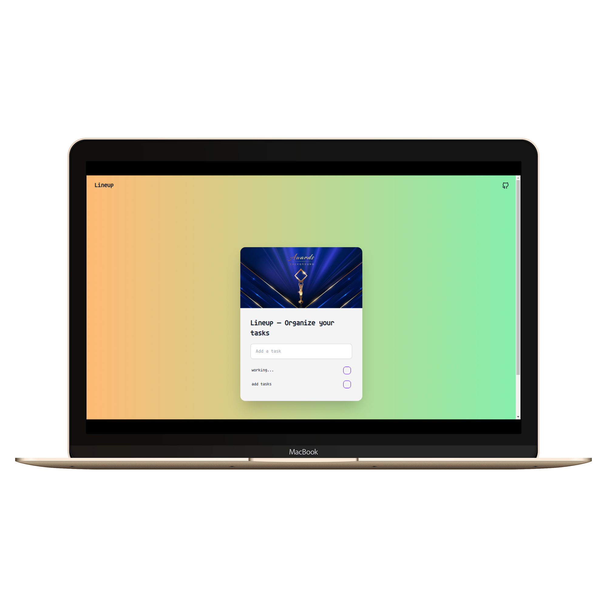

# Lineup

A simple to-do list app built using Tailwind CSS for styling and localForage for storing tasks locally. The app allows users to add, edit, and remove tasks. It stores data in the browser, so your to-do list persists even after a page refresh.



## Features

- Local storage using localForage
- Dark mode
- Responsive design
- Keyboard navigation
- Task sorting
- Task completion
- Task deletion

## Getting Started

To get started, follow these steps:

1. Clone the repository:

```bash
git clone https://github.com/vishallokhande8788/lineup.git
```

2. Install the dependencies:

```bash
npm install
```

3. Run the development server:

```bash
npm run dev
```